# sched

## Informe

 <!-- Guía para tamaños de las imágenes: 1 línea de texto son 20px. Por ejemplo, para 4 líneas de texto se tendría 4*20 = 80 => height="80px" -->

Tabla de contenidos:

1. [Visualización del cambio de contexto](#Visualización-del-cambio-de-contexto)
2. [Implementación de scheduler con prioridades](#Implementación-de-scheduler-con-prioridades)
3. [Procesos de usuario creados](#Procesos-de-usuario-creados)

### Visualización del cambio de contexto

Se comienza el análisis de ejecución justo antes de ingresar a la función `context_switch`:


Se muestra el estado del `struct Trapframe` de un environment de tipo `hello.c`:


El code segment (`tf_cs`) posee en los 2 lowest bits el ring con el que se ejecutará el env:


En binario, 27 es representado como `11011`, y los últimos dos bits (`11`) equivalen al CPL (Current Privilege Level), o ring, 3.

Se muestran todos los valores del `struct Env`:


Se avanza la ejecución (siempre se hará de a una línea a la vez), para ejecutar:


Se muestran los valores almacenados en los registros:


Se muestran los últimos 28 valores (de 32 bits, en formato hexadecimal) del stack:


Se avanza la ejecución para ejecutar:

```
    mov (%esp), %esp
```

Se muestran los valores almacenados en los registros:


Se muestran los últimos 28 valores (de 32 bits, en formato hexadecimal) del stack:

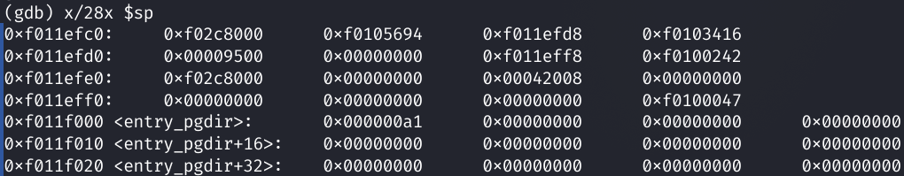

Se avanza la ejecución para ejecutar:

```
    popal
```

Se muestran los valores almacenados en los registros:


Se muestran los últimos 28 valores (de 32 bits, en formato hexadecimal) del stack:

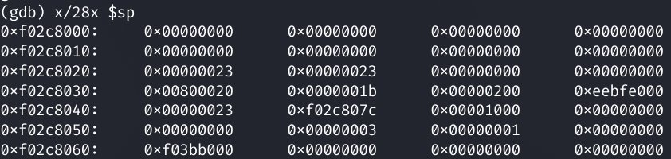

Se avanza la ejecución para ejecutar:

```
    pop %es
```

Se muestran los valores almacenados en los registros:

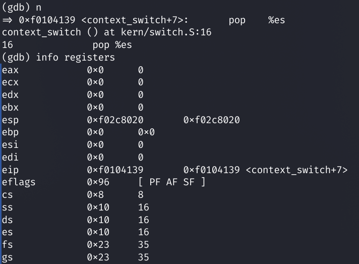

Se muestran los últimos 28 valores (de 32 bits, en formato hexadecimal) del stack:


Se avanza la ejecución para ejecutar:

```
    pop %ds
```

Se muestran los valores almacenados en los registros:

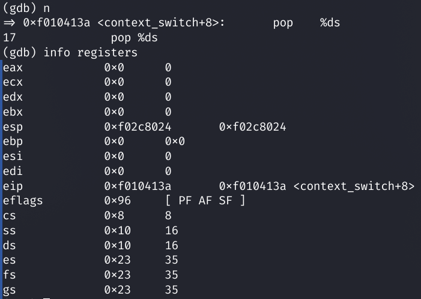

Se muestran los últimos 28 valores (de 32 bits, en formato hexadecimal) del stack:

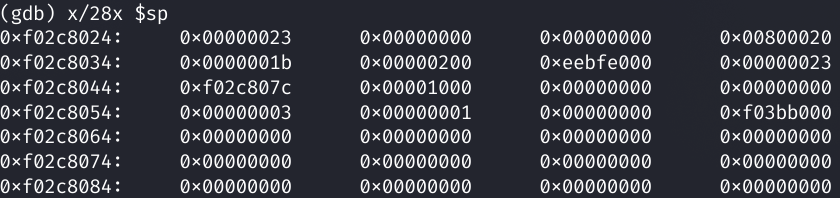

Se avanza la ejecución para ejecutar:

```
    add $8, %esp
```

Se muestran los valores almacenados en los registros:


Se muestran los últimos 28 valores (de 32 bits, en formato hexadecimal) del stack:


Se avanza la ejecución para ejecutar:

```
    iret
```

Se muestran los valores almacenados en los registros:


Se muestran los últimos 28 valores (de 32 bits, en formato hexadecimal) del stack:


Se avanza la ejecución, por lo que se ejecutó `iret` y se transfirió el control de ejecución al programa de usuario.


Se muestran los valores almacenados en los registros:

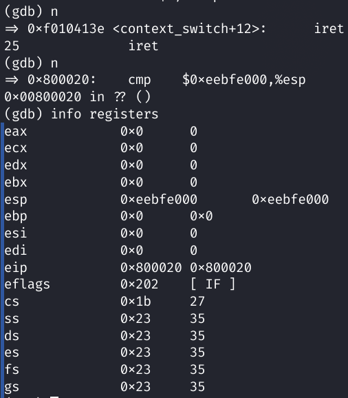

### Verificación de las syscalls funcionando

Se pone un breakpoint en `gdb` en la función `sys_cputs`, syscall cuya definición se encuentra en `kern/syscall.c`. Esta syscall es una parte esencial del funcionamiento de la función `cprintf`, de funcionamiento análogo al printf de la biblioteca estándar de C.

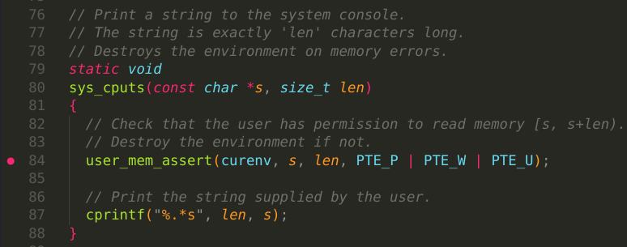

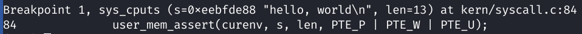

Utilizando el programa de usuario `hello.c`, que sólo imprime por pantalla dos líneas de texto, se verificará empíricamente que el cambio user-kernel y kernel-use:

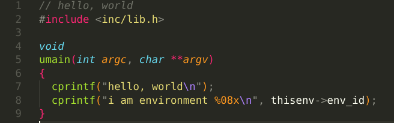

Se deja pasar una ejecución de la syscall y se observa el output del programa como `hello, world` en la pantalla:

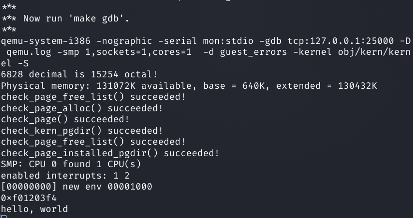

Se para el programa en el segundo `cprintf`, y en gdb se observa que a la función `sys_cputs` efectivamente llega el string argumento:

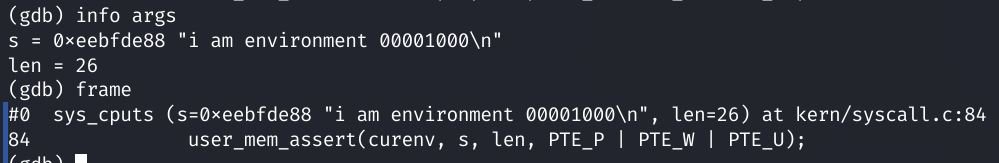


Continuando la ejecución, se imprime el string mencionado como output del programa:


La ejecución finaliza exitosamente:

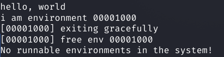

### Implementación de scheduler con prioridades

#### Políticas

El scheduler con prioridades posee 5 niveles de prioridad, siendo 0 la prioridad más alta y 4 la prioridad más baja.

Se tiene una política de boost de 45 ejecuciones, lo que significa que cada 45 veces que se le cede la ejecución al scheduler se elevan todas las prioridades a la más alta, esto es independiente de la cantidad de procesos que están corriendo al mismo tiempo.

La política de disminución de prioridad es de 5 ejecuciones, lo que significa que cuando un proceso en particular es elegido 5 veces (independientemente de que se hayan ejecutado otros procesos en el medio) se le disminuye 1 nivel de prioridad, en caso de que ya esté en el mínimo, permanecerá ahí.

El proceso/environment seleccionado será el subsecuente al proceso que esté corriendo al momento, en estado `RUNNABLE` y con la mayor prioridad.

Un nuevo proceso producto de un fork tendrá la misma prioridad que el padre (el caller de fork).

#### Implementación

El `struct Env` posee un campo `env_priority` que señala el nivel de prioridad explicado anteriormente, y un campo `env_sched_runs_current` que lleva la cuenta desde el último boost de las veces que el scheduler le decidió ejecutar ese proceso, así como un campo `env_sched_runs_total` que lleva la cuenta desde la creación del environment.

Apenas se cede la ejecución al scheduler, se verifica si es necesario realizar un boost comparando contra un contador `yield_counter` almacenado como información de estadística del scheduler mismo, este aumenta en 1 cada vez que se le cede la ejecución. Si se llegó al threshold para boostear, se recorre el array `envs` para setear todos los campos `env_priority` en `0`, y también se reinicia el `env_sched_runs_current`.

Para la selección del siguiente environment a correr, el scheduler no posee estructuras de datos auxiliares de tiempo de vida permanente. Cuando se hace la búsqueda, se itera sobre el array `envs` hasta encontrar el primer environment `RUNNABLE` de prioridad máxima, además se guardan 5 punteros en un array auxiliar que se actualizar elemento a elemento durante la iteración para representar el primer elemento `RUNNABLE` de la prioridad correspondiente al índice (es decir que el índice `0` es la prioridad `0`, el índice `1` es la prioridad `1` y así). Esto permite que si no se encontró un elemento de prioridad máxima, se podrá iterar sobre el array auxiliar de 5 elementos para verificar si existe un environment `RUNNABLE` de otra prioridad, que sea máxima para el subconjunto de los runnables. De no encontrar ninguno `RUNNABLE` se seguirá ejecutando el proceso que ya se estaba ejecutando, si está en estado `RUNNING`.

Al iterar el array `envs` para seleccionar cuál environment se ejecutará, primero se evalúan los elementos subsiguientes al proceso que esté corriendo al momento, y luego, de forma circular, se evalúan desde el primer elemento hasta el proceso actual.

Si no se pudo seleccionar ningún proceso para correr, se llama a `sched_halt`.

Si sí se pudo seleccionar un proceso para correr, se le aumenta en 1 sus env_sched_runs (total y current) y antes de ejecutarlo con `env_run` se verifica si es necesario disminuir la prioridad del environment, esto se hace comparando el `env_sched_runs_current` contra el valor de la política de disminución establecida (5 elecciones del scheduler). Si es necesario disminuir la prioridad, se incrementa en 1 el campo `env_priority` del `struct Env`, recordando que que mientras más alto el valor numérico, menor es su nivel de prioridad (<i>lower is better</i>), si la prioridad ya es mínima, se deja como está.

Para que un proceso hijo tenga la misma prioridad que el padre, en la syscall `sys_exofork` se realiza la igualación de prioridades, permitiendo que todas las versiones de wrappers de tipo fork tengan esta característica.

### Procesos de usuario creados

Con el objetivo de mostrar el comportamiento del scheduler implementado, se crearon dos nuevos procesos de usuario:
- `looping`, un programa que itera por una gran cantidad de números con el propósito de que se activen *timer interrumpts* y así llegar a disminuir la prioridad del proceso, la cual se muestra por pantalla cada cierta cantidad de iteraciones para observar su evolución. 
- `processes`, un programa que realiza dos forks y por lo tanto termina creando 3 procesos en total. Cada uno de ellos realiza un ciclo en el cual le cede la ejecución al scheduler para ir alternando entre los procesos en espera y así lograr que disminuyan sus prioridades.

En ambos programas se podrá observar también el momento en que se aplica la política de *boosting* para elevar las prioridades de todos los procesos actuales. <br>
Para probar la ejecución de estos nuevos procesos se pueden correr los comandos `make run-looping-nox USE_PR=1` o `make run-processes-nox USE_PR=1` para correr cada uno por separado. También se puede modificar la creación de los enviroments en `init.c` (como ya figura en la línea 78) y correrlos con `make qemu-nox USE_PR=1`.
