# sched

## Informe

 <!-- Guía para tamaños de las imágenes: 1 línea de texto son 20px. Por ejemplo, para 4 líneas de texto se tendría 4*20 = 80 => height="80px" -->

### Visualización del cambio de contexto

Se comienza el análisis de ejecución justo antes de ingresar a la función `context_switch`:

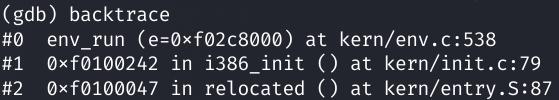

Se muestra el estado del `struct Trapframe` de un environment de tipo `hello.c`:

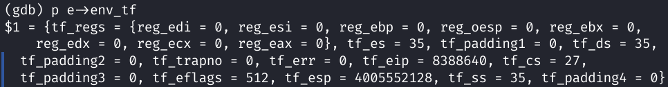

El code segment (`tf_cs`) posee en los 2 lowest bits el ring con el que se ejecutará el env:

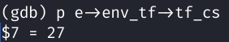

En binario, 27 es representado como `11011`, y los últimos dos bits (`11`) equivalen al CPL (Current Privilege Level), o ring, 3.

Se muestran todos los valores del `struct Env`:

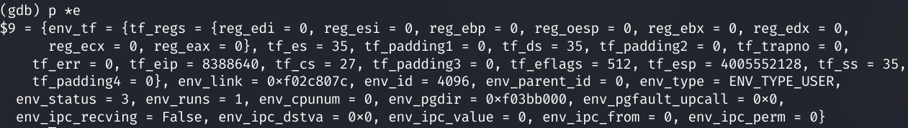

Se avanza la ejecución (siempre se hará de a una línea a la vez), para ejecutar:

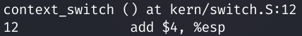

Se muestran los valores almacenados en los registros:

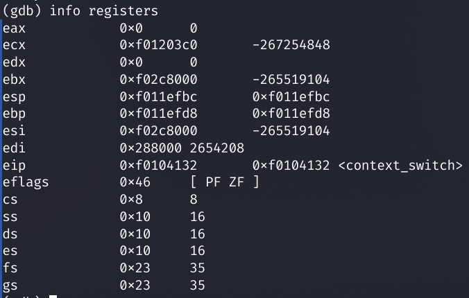

Se muestran los últimos 28 valores (de 32 bits, en formato hexadecimal) del stack:

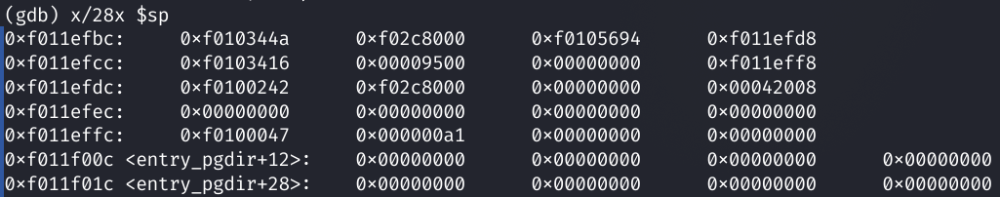

Se avanza la ejecución para ejecutar:

```
    mov (%esp), %esp
```

Se muestran los valores almacenados en los registros:

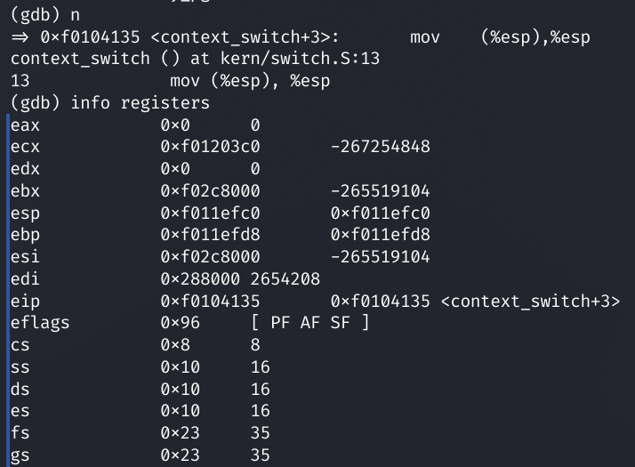

Se muestran los últimos 28 valores (de 32 bits, en formato hexadecimal) del stack:


Se avanza la ejecución para ejecutar:

```
    popal
```

Se muestran los valores almacenados en los registros:

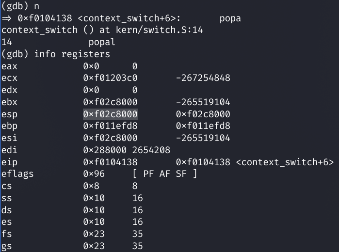

Se muestran los últimos 28 valores (de 32 bits, en formato hexadecimal) del stack:


Se avanza la ejecución para ejecutar:

```
    pop %es
```

Se muestran los valores almacenados en los registros:


Se muestran los últimos 28 valores (de 32 bits, en formato hexadecimal) del stack:

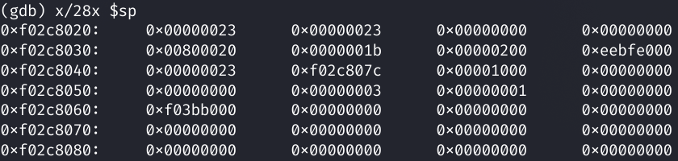

Se avanza la ejecución para ejecutar:

```
    pop %ds
```

Se muestran los valores almacenados en los registros:


Se muestran los últimos 28 valores (de 32 bits, en formato hexadecimal) del stack:


Se avanza la ejecución para ejecutar:

```
    add $8, %esp
```

Se muestran los valores almacenados en los registros:

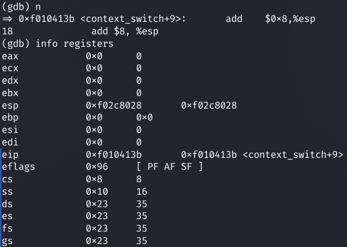

Se muestran los últimos 28 valores (de 32 bits, en formato hexadecimal) del stack:

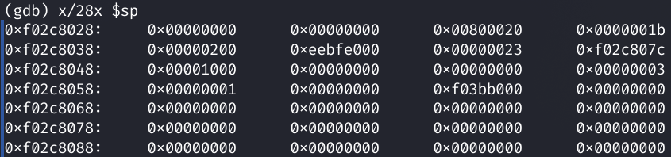

Se avanza la ejecución para ejecutar:

```
    iret
```

Se muestran los valores almacenados en los registros:

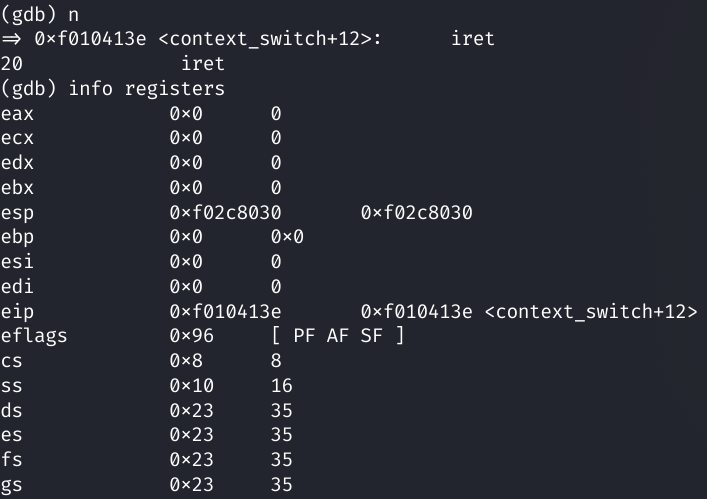

Se muestran los últimos 28 valores (de 32 bits, en formato hexadecimal) del stack:

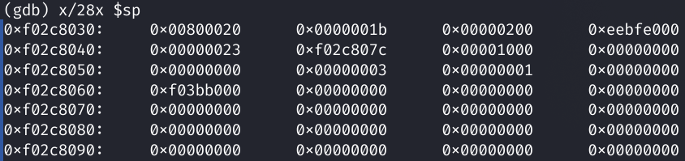

Se avanza la ejecución, por lo que se ejecutó `iret` y se transfirió el control de ejecución al programa de usuario.

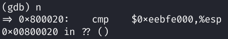

Se muestran los valores almacenados en los registros:


### Verificación de las syscalls funcionando

Se pone un breakpoint en `gdb` en la función `sys_cputs`, syscall cuya definición se encuentra en `kern/syscall.c`. Esta syscall es una parte esencial del funcionamiento de la función `cprintf`, de funcionamiento análogo al printf de la biblioteca estándar de C.


Utilizando el programa de usuario `hello.c`, que sólo imprime por pantalla dos líneas de texto, se verificará empíricamente que el cambio user-kernel y kernel-use:


Se deja pasar una ejecución de la syscall y se observa el output del programa como `hello, world` en la pantalla:


Se para el programa en el segundo `cprintf`, y en gdb se observa que a la función `sys_cputs` efectivamente llega el string argumento:


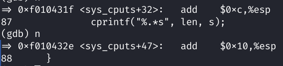

Continuando la ejecución, se imprime el string mencionado como output del programa:

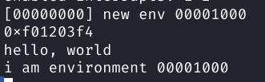

La ejecución finaliza exitosamente:


### Implementación de scheduler con prioridades

Programas de test: `prioritytest1.c`
